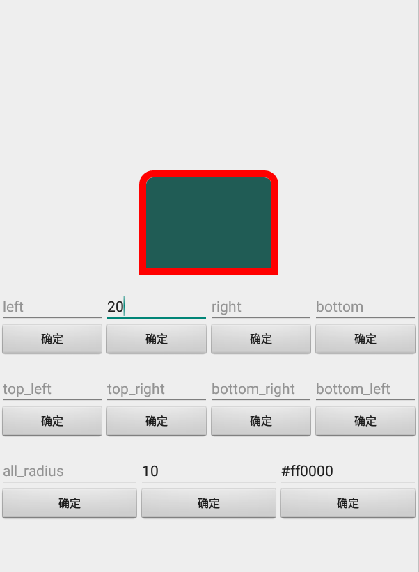

# EasyView
<p align="center">
    <a href="https://github.com/liqvip">
        
    </a>
    <a href="https://jitpack.io/#liqvip/EasyView">
        
    </a>
    <a href="https://github.com/liqvip/EasyView/blob/main/LICENSE">
        
    </a>
</p>

### 效果预览

|||
|---|---|
|||
|||
|||
|||

### 注意
1. 最低支持版本为 Android 5.0，即你项目配置的 minSdkVersion 需要大于等于 21
2. 本项目是 AndroidX 版本，不提供 Support 版本

### 项目特点
1. 完全使用 Kotlin
2. 目前支持 **View，TextView，ImageView，Button，ConstraintLayout，LinearLayout，RelativeLayout，FrameLayout，RecyclerView** 控件的圆角与描边
3. 使用非常简单，在 xml 布局文件中配置或代码中使用

### 如何使用
#### 第一步
在项目根目录下的 `build.gradle` 中添加 jitpack 仓库
```groovy
allprojects {
    repositories {
        ...
        maven { url 'https://jitpack.io' }
    }
}
```

#### 第二步
在对应模块的 `build.gradle` 中添加 EasyView 的依赖
```groovy
dependencies {
    ...
    implementation 'com.github.liqvip:EasyView:1.0.1'
}
```

#### 第三步
在布局文件中添加需要使用的 EasyView，以下是简单示例
```
<com.github.easyview.EasyImageView
    android:layout_width="@dimen/dp_200"
    android:layout_height="@dimen/dp_200"
    app:ev_radius="@dimen/dp_100"
    app:ev_stroke_width="@dimen/dp_5"
    app:ev_stroke_color="@color/demo18"/>

<com.github.easyview.EasyRelativeLayout
    android:layout_width="@dimen/dp_250"
    android:layout_height="@dimen/dp_150"
    app:ev_topLeft_radius="@dimen/dp_50"
    app:ev_bottomLeft_radius="@dimen/dp_20"
    app:ev_stroke_width="@dimen/dp_5"
    app:ev_stroke_color="@color/demo6"/>

......
```

### 有哪些属性
| 属性名                   | 说明         | 默认值 |
|-----------------------|------------|-----|
| ev_radius             | 四个角的圆角半径    | 0dp |
| ev_left_radius        | 左边两个角的圆角半径 | 0dp |
| ev_top_radius         | 上边两个角的圆角半径 | 0dp |
| ev_right_radius       | 右边两个角的圆角半径 | 0dp |
| ev_bottom_radius      | 下边两个角的圆角半径 | 0dp |
| ev_topLeft_radius     | 左上方角的圆角半径  | 0dp |
| ev_topRight_radius    | 右上方角的圆角半径  | 0dp |
| ev_bottomRight_radius | 右下方角的圆角半径  | 0dp |
| ev_bottomLeft_radius  | 左下方角的圆角半径  | 0dp |
| ev_stroke_width       | 描边宽度           | 0dp |
| ev_stroke_color       | 描边颜色           | #FFFFFFFF |

### 有哪些方法
| 方法名                                                                                     | 说明               | 对应属性                  |
|-------------------------------------------------------------------------------------------|------------------------|-----------------------|
| setRadius(dp: Float)                                                                      | 设置四个角的圆角半径 | ev_radius             |
| setRadius(topLeftDp: Float, topRightDp: Float, bottomRightDp: Float, bottomLeftDp: Float) | 设置四个角的圆角半径 | ev_radius             |
| setLeftRadius(dp: Float)                                                                  | 设置左方两个角的圆角半径 | ev_left_radius        |
| setTopRadius(dp: Float)                                                                   | 设置上方两个角的圆角半径 | ev_top_radius         |
| setRightRadius(dp: Float)                                                                 | 设置右方两个角的圆角半径 | ev_right_radius       |
| setBottomRadius(dp: Float)                                                                | 设置下方两个角的圆角半径 | ev_bottom_radius      |
| setTopLeftRadius(dp: Float)                                                               | 设置左上方圆角半径 | ev_topLeft_radius     |
| setTopRightRadius(dp: Float)                                                              | 设置右上方圆角半径 | ev_topRight_radius    |
| setBottomRightRadius(dp: Float)                                                           | 设置右下方圆角半径 | ev_bottomRight_radius |
| setBottomLeftRadius(dp: Float)                                                            | 设置左下方圆角半径 | ev_bottomLeft_radius |
| setStrokeWidth(dp: Float)                                                                 | 设置描边宽度 | ev_stroke_width |
| setStrokeColor(color: Int)                                                                | 设置描边颜色 | ev_stroke_color |
| setStrokeColor(argb: String)                                                              | 设置描边颜色 | ev_stroke_color |
| setStrokeWidthColor(widthDp: Float, color: Int)                                           | 同时设置描边宽度和颜色 | ev_stroke_width,ev_stroke_color |

### 在真机上运行测试
读者可以在手机上运行此项目，动态设置 View 的圆角、描边等属性，感受实际效果。下面是运行截图。


### 版本记录
| 版本号    | 更新内容         | 备注           |
|--------|--------------|--------------|
| v1.0.1 | 1. 增加真机测试界面 2. 修复代码动态设置描边不生效的问题 | 请使用 v1.0.1 版本，避免动态设置描边不生效 |
| v1.0.0 | First commit | First commit |

### Issue 模板
非常感谢各位开发者对本库的支持，使用中如果遇到什么问题，**请务必按照以下模板（步骤）**，将问题描述清楚，方便作者尽快的解决问题！</br>
1. 在什么环境/情况下遇到了什么问题。
```
......
```

2. 如何重现该问题（描述具体重现步骤！可在此处贴截图和出现问题的代码片段）。
```
......
```

3. 你希望得到什么结果。
```
......
```
