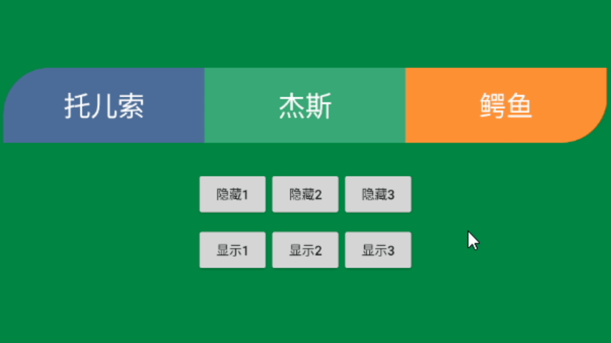

# EasyTextViewGroup
## 效果预览
可以显示任意、隐藏任意一个 TextView，且圆角能随着 TextView 数量的减少或增加始终显示在最左最右方。


上面效果的 xml 文件如下
```xml
<com.github.easyview.EasyTextViewGroup
    android:id="@+id/tv_group"
    android:layout_width="match_parent"
    android:layout_height="@dimen/dp_80"
    android:layout_marginStart="@dimen/dp_10"
    android:layout_marginEnd="@dimen/dp_10"
    app:ev_textView_count="3"
    app:ev_topLeft_radius="@dimen/dp_50"
    app:ev_bottomRight_radius="@dimen/dp_50"/>
```

## 应用场景
这个控件的灵感当时来源于 UI 的一个需求。一件事物可能拥有多个属性，有些没有，有些有。需要根据后台返回的数据来确定，
当时第一反应是简单的用多个 TextView 组合成这样的控件，后面发现一旦属性达到3个以上，就要写大量的 shape 文件来分别
来为每个 TextView 设置圆角，糟糕的是还要写大量的 `if...else` 代码来判断。作为一个追求优雅的程序员，就花了点时间
完成了这个自定义 View，如果对读者有帮助，帮我点个 Star 就行啦！

## 有哪些属性
| 属性名                   | 说明         | 默认值 |
|-----------------------|------------|-----|
| ev_textView_count     | TextView 的数量   | 0 |
| ev_radius             | 四个角的圆角半径    | 0dp |
| ev_left_radius        | 左边两个角的圆角半径 | 0dp |
| ev_top_radius         | 上边两个角的圆角半径 | 0dp |
| ev_right_radius       | 右边两个角的圆角半径 | 0dp |
| ev_bottom_radius      | 下边两个角的圆角半径 | 0dp |
| ev_topLeft_radius     | 左上方角的圆角半径  | 0dp |
| ev_topRight_radius    | 右上方角的圆角半径  | 0dp |
| ev_bottomRight_radius | 右下方角的圆角半径  | 0dp |
| ev_bottomLeft_radius  | 左下方角的圆角半径  | 0dp |

## 有哪些方法
| 方法名                                                                                     | 说明                                         | 对应属性                  |
|-------------------------------------------------------------------------------------------|----------------------------------------------|-----------------------|
| setChildrenBgColor(argb: Array<String?>)                                                  | 设置每个 TextView 的背景颜色                   | 无            |
| setChildrenBgColor(resId: IntArray)                                                       | 设置每个 TextView 的背景颜色                   | 无            |
| setChildrenText(text: Array<String?>)                                                     | 设置每个 TextView 的文字                       | 无            |
| setChildrenText(resId: IntArray)                                                          | 设置每个 TextView 的文字                       | 无            |
| setChildrenTextColor(argb: Array<String?>)                                                | 设置每个 TextView 的文字颜色                    | 无           |
| setChildrenTextColor(resId: IntArray)                                                     | 设置每个 TextView 的文字颜色                    | 无           |
| setChildrenTextSize(sp: Int)                                                              | 设置每个 TextView 的文字大小                    | 无           |
| show(position: Int)                                                                       | 显示 position（从0开始） 位置上的 TextView      | 无            |
| hide(position: Int)                                                                       | 隐藏 position（从0开始） 位置上的 TextView      | 无            |
